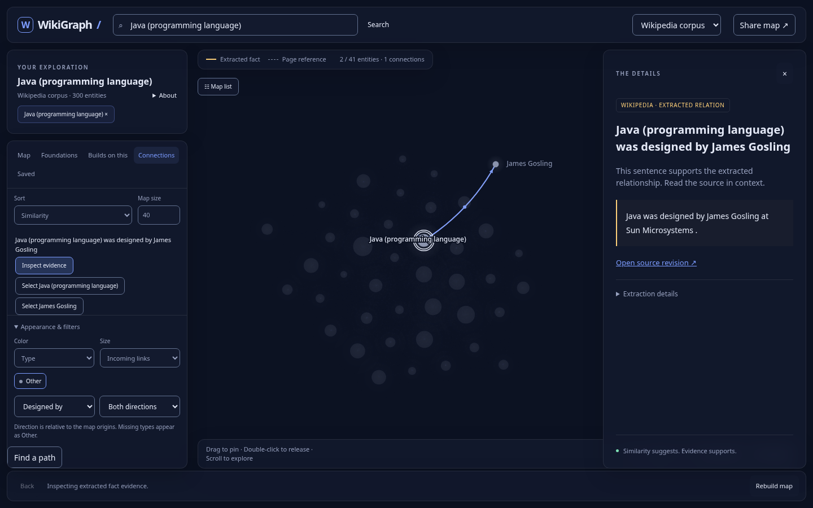

# WikiGraph

Explore connections between computing topics and inspect the source behind each
edge. WikiGraph builds a revision-backed RDF graph from Wikipedia, serves bounded
queries through a typed API, and provides an interactive graph and accessible list.



[Watch the one-minute walkthrough](docs/media/demo.webm) · [Technical case study](docs/case-study.md) ·
[Release notes](docs/release-notes.md) · [Visual verification](docs/visual-verification.md)

## Try it

Python 3.11+ is supported; the locked environment was verified with Python 3.13.

```sh
python -m venv .venv
. .venv/bin/activate
pip install -r requirements.lock
pip install -e . --no-deps
wikigraph demo
uvicorn wikigraph.api:create_app --factory --host 127.0.0.1 --port 8000
```

Open http://localhost:8000. The explorer opens the API dataset by default.
The `wikigraph demo` command above builds an **authored synthetic teaching
sample**, with clearly labeled fictional revisions. Select the offline mode
(or use `?mode=offline`) to run the bundled browser sample without the API.

To serve the real checked-in corpus:

```sh
WIKIGRAPH_GRAPH=data/wikipedia/graph.ttl uvicorn wikigraph.api:create_app --factory
```

Choose **Wikipedia corpus** in the explorer. API docs are at `/docs`.
Alternatively, run `docker compose up --build -d`.

## What is implemented

- Revision-pinned fetching, bounded retries and request budgets, durable raw
  snapshots, offline replay, and resumable SQLite ingestion jobs.
- Canonical page identities, alias resolution, distinct unresolved mentions,
  addressable assertions, and SHACL plus evidence-integrity validation.
- Conservative factual extraction with sentence offsets; `linksTo` stays separate
  from factual predicates.
- Typed search, paginated neighbors, bounded shortest paths, evidence lookup,
  request IDs, metrics, and a per-process request quota.
- Dark Canvas 2D workspace with glowing, data-sized nodes, cooling force simulation,
  pinning, collision-aware labels, pan/pinch/zoom and an accessible entity list.
- One-to-three-origin similarity maps with weighted shared-neighbor explanations,
  Foundations / Builds on this lists, and independently inspectable source evidence.
- Stable expansion, filter fading, conditional year brushing, saved-list exports,
  mobile detail sheets, reduced motion and shareable map state. The offline teaching
  sample uses the same scoring rules as the API.
- Python CI and Chromium browser checks, reproducible exports, evaluation tooling,
  and a measured local HTTP benchmark.

## Explore the map

Choose a suggested origin or search for one. Select a node to read its details;
**Add as origin** compares up to three starting points. **Why is this related?**
shows shared neighbors and direct evidence. Similarity describes graph structure,
not factual confidence. Dashed references and gold factual relations remain distinct.

Drag a node to pin it; double-click to release. Scroll or pinch to zoom, **Fit** to
frame the map, and **Re-arrange** to release settled positions while keeping pins.
Use **Pause motion** or your system's reduced-motion setting to stop animation.
Keyboard: `/` focuses search, arrow keys on the canvas select connected entities,
Enter expands, `f` fits, and Escape closes details. The lists provide equivalent actions.

Appearance controls change type/cluster coloring and node size. Filters fade items
without rearranging the map. Shift-drag selects a group. Save entities from Details,
then export JSON, CSV or Markdown from the Saved tab. Saved entries stay in your browser.
**Share map** preserves origins, selection, additions, expansion, removals, filters,
encodings, camera, pins and inspected evidence. Mobile panels collapse to make room.

The normal view is bounded to **150 entities / 500 connections**, with 12 assertions
per expansion and factual edges prioritized at the cap. A map recommends 5–80 related
entities plus its origins. No meaningful types or years are supplied by the current
corpora: types display as Other and the timeline/year coloring stay hidden.

## Evidence and limits

The real corpus contains **300 entities, 5,113 assertions, and 105,268 triples**.
Of those assertions, 5,111 are page links and two are factual relations. Extraction
coverage is deliberately limited; no real-corpus precision claim has been made.

The synthetic regression split produced 30 true positives, zero false positives,
and ten false negatives. Those known templates do **not** establish Wikipedia
accuracy. The 199 frozen real annotation candidates remain unreviewed, and evaluation
refuses to score them until review is recorded.

A local five-client HTTP benchmark measured p95 latency of 20.97 ms for search,
9.94 ms for neighbors, and 35.59 ms for the tested path query. These are one-run,
300-page results; the specified local latency gate passed, but this is not an internet SLA.
See [measured results](docs/benchmark.md) and [raw report](reports/benchmark.json).

The Cosmos renderer measured about 60 FPS in a headless Chromium camera-pan test
at 300 nodes / 900 edges, with zero idle redraws. Real-corpus one-, two- and three-origin
map requests took 18–32 ms locally; RDF startup was measured separately at 7.27 seconds.
These are local measurements, not a device or hosting SLA. See the
[implementation log](docs/redesign-log.md) and [renderer report](reports/cosmos-renderer.json).

## Reproduce and develop

```sh
pip install -r requirements-dev.lock
pip install -e . --no-deps
ruff check src tests scripts
mypy src/wikigraph
pytest -q
python scripts/rebuild_corpus.py --output /tmp/wiki-rebuild/graph.ttl
cmp data/wikipedia/graph.ttl /tmp/wiki-rebuild/graph.ttl
wikigraph evaluate
cd frontend
npm ci
npm run build
npx playwright install chromium
npm test
node verify-renderer.mjs
```

The real corpus rebuild was verified byte-for-byte without network access.
Frontend assets are bundled in the Python package; Node is needed only to change
or test the frontend.

## Design and next release gates

[Product scope](docs/product-scope.md) · [Progress](docs/progress.md) ·
[Ingestion](docs/ingestion.md) · [Identity and provenance](docs/decisions/001-identity-and-provenance.md) ·
[Extraction tradeoffs](docs/decisions/002-extraction-and-real-corpus.md) ·
[Annotation protocol](docs/annotation.md) · [API](docs/api.md) ·
[Explorer](docs/explorer.md) · [Deployment](docs/deployment.md)

Pending: independent annotation of the frozen real evaluation split,
independent reproduction, three-person usability review and verification of the production deployment. The optional
[Neo4j projection](docs/neo4j.md) has verified batched imports and RDF round-trip
fidelity; the public API continues to use RDFLib.

The [review handoff](docs/review-handoff.md) provides concrete tasks for reviewers.
The [dependency review](docs/dependencies.md) records audit results, license
metadata, and their scope. [Demo instructions](docs/demo.md) reproduce the video.

Wikipedia text and derived text datasets retain their source licensing and
attribution; see [corpus terms](data/wikipedia/README.md) and
[per-page sources](data/wikipedia/SOURCES.md). Synthetic examples are labeled
separately and are not presented as Wikipedia evidence.
