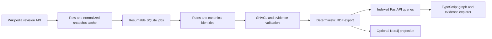

# WikiGraph: making graph connections inspectable

WikiGraph turns Wikipedia snapshots into a small graph explorer where a reader
can inspect why each edge exists. The engineering challenge is preserving
identity and evidence while bounding ingestion and query work.

The release corpus has 300 pages, 5,113 assertions and 105,268 RDF triples. Its
5,111 page-link assertions mean “this page references that page.” Only two
assertions currently express extracted facts. Keeping that distinction visible
prevents a dense graph from implying semantic accuracy it has not established.

## Architecture and constraints

Fetching has retry and request budgets. Revision IDs tie evidence to stored text;
serving uses a prebuilt graph and makes no Wikipedia requests. This makes a demo
repeatable when Wikipedia is unavailable, at the cost of needing a separate
ingestion run to refresh it.

RDF remains the canonical representation because statements, provenance, and
validation fit the problem. In-memory indexes make small bounded API queries
fast. They require loading the full dataset, so memory is the next scaling
constraint; a larger corpus needs measurement before a storage redesign.

## Decisions and bugs worth discussing

**Identity:** titles can redirect, change, or collide across namespaces. Entity
URIs use source namespace and page ID, while unresolved mentions remain distinct.
Unicode-normalized, case-preserving aliases help matching without silently
merging different resources. See the [identity decision](decisions/001-identity-and-provenance.md).

**Traversal correctness:** a breadth-first search originally risked discarding
a target already queued when the visited-node cap was reached. The bounded
search now continues processing queued nodes while refusing additional nodes.
Regression coverage checks this boundary and meaningful truncation reporting.
See [query behavior](decisions/004-bounded-query-behavior.md).

**Browser consistency:** paginated entity loading and delayed responses can
otherwise make shared selections disappear or overwrite a newly chosen dataset.
The explorer loads all pages up to its explicit cap and rejects stale dataset,
search, and evidence responses. Chromium regression flows cover these and the flagship
search → evidence → path → share workflow.

**Extraction:** conservative linked-target rules are explainable and inexpensive,
but omit many valid sentences. The synthetic regression report has 30 true
positives, zero false positives, and ten false negatives. This is evidence about
known templates, not a real-world precision estimate. The 199 real candidates
have frozen page-disjoint splits and await two-person review before scoring.
See the [evaluation protocol](annotation.md).

**Optional storage:** Neo4j preserves RDF term kinds, literal datatypes/languages,
and dataset fingerprints through repeat imports. The full corpus round-trip
passed. A single traversal measured 6.32 ms p95 over Bolt versus 0.067 ms in-process
RDF indexing; transport and execution differ, so this does not rank the databases
generally. See the [comparison and limitations](neo4j.md).

## Measured results

| Check | Recorded result | Scope |
| --- | --- | --- |
| Offline rebuild | 6.53 seconds; identical SHA-256 | One 300-page run, zero requests |
| Search p95 | 20.97 ms | 100 requests, five clients, loopback HTTP |
| Neighbors p95 | 9.94 ms | Same benchmark configuration |
| Path p95 | 35.59 ms | One fixed bounded path workload |
| Server peak RSS | 288,940 KiB | Benchmark process |
| Automated checks | 49 Python tests, 15 Chromium tests | Local release verification |

Hardware, cold-query values, distributions, and exact dataset hash are in the
[benchmark report](../reports/benchmark.json). The
[rebuild report](../reports/rebuild.json) records export equality.

## What remains unproven

The real precision target, independent reproducibility, and three-person
usability gate remain open. Public hosting requires account access. The expanded
corpus is selected partly by link overlap and is not wholly hand-curated.
Per-process quotas need a shared reverse-proxy policy for multiple workers.
The prepared deployment has no public availability claim.

A defensible portfolio description is: “Built a revision-backed graph explorer
for 300 Wikipedia pages with deterministic offline rebuilds, bounded typed APIs,
and a measured 20.97 ms local search p95 at five concurrent clients.” Add a real
accuracy number only after independent labels support it.
