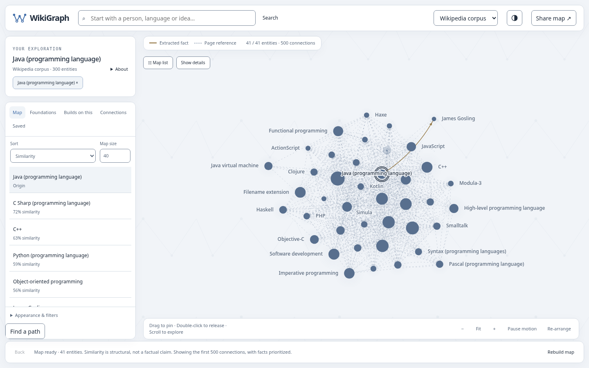
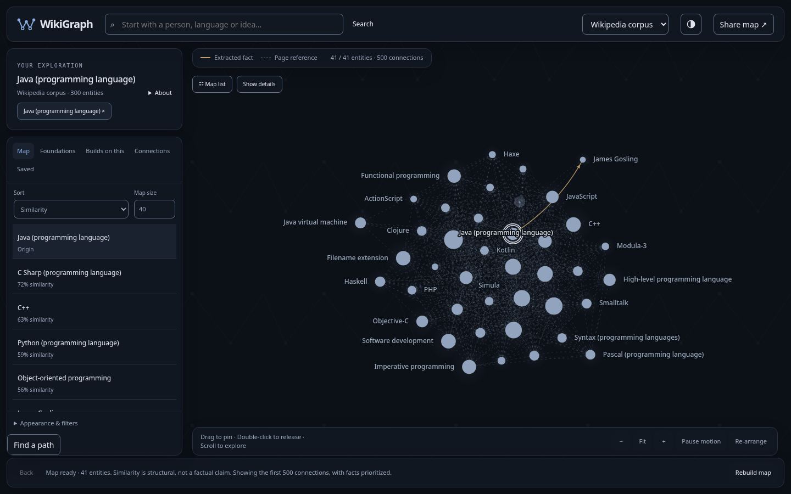
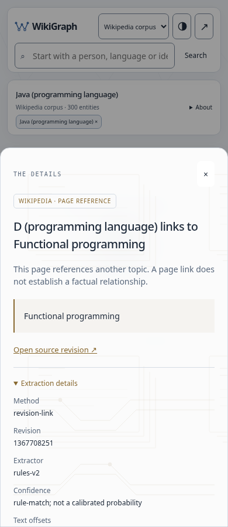
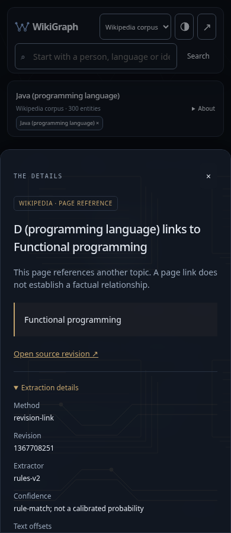

# WikiGraph visual system

The production app adapts the supplied pattern atlas into a restrained knowledge-exploration workspace. The reference HTML remains local; its mock records and customization gallery are not shipped.

## Ownership

- `src/wikigraph/static/tokens.css`: semantic dark/light colors shared with Canvas, control borders, surface shadows, and graph emphasis.
- `src/wikigraph/static/patterns.css` and `pattern-*.svg`: reusable, repeating SVG masks. Patterns are noninteractive backgrounds, not graph data or separate illustrations.
- `index.html` and `favicon.svg`: connected-W mark, matching the graph's circular-node geometry.
- `theme.js`: pre-paint theme initialization. `frontend/src/theme.ts`: accessible theme switch, stored preference, and operating-system preference when no choice is stored.
- `GraphView.refreshTheme()`: invalidates color caches and repaints without changing map membership, pins, camera, or simulation state.

## Surface choices

| Surface | Pattern | Opacity |
| --- | --- | --- |
| Graph workspace | Linked field | 5% |
| Landing and empty lists | Neighborhood rings | 5–8% |
| Search results | Neighborhood rings | 10% |
| Entity details | Research lens | 8% |
| Relationship explanations | Citation branches | 10% |
| Saved entities | Archive strata, blue-gray | 8% |
| Evidence | Archive strata, provenance gold | 6% |
| Source revision / extraction details | Revision currents, provenance gold | 9% |

Gold identifies evidence, provenance, and extracted factual edges. Ordinary entity types and structural clusters use cool colors. Page links remain dashed and factual edges solid; similarity is still explained separately and never rendered as a factual claim. Revision fields show the actual assertion metadata; there is no fabricated revision history.

The existing desktop panels become mobile sheets, with focus trapping and focus restoration preserved. The brand mark remains visible at narrow widths; the wordmark yields space below 370px. Patterns disappear in forced-colors mode and never intercept pointer input.

## Validation

- TypeScript check and production bundle build passed.
- 37 Chromium tests passed, including original graph gestures, keyboard navigation, paths, search, saved exports, and share restoration.
- Theme coverage includes 1440px, 390px, and 320px; existing responsive checks also cover 900px. Both system preference and persisted choice work, including unavailable storage.
- Canvas pixel checks confirm theme repaint while camera and pins remain unchanged. Semantic text colors meet 4.5:1 contrast on both base surfaces in both themes.
- Ruff, mypy, and all 53 Python tests passed (two existing dependency deprecation warnings).
- Renderer stress: 300 nodes / 900 edges, approximately 60 FPS, 6.1ms p95 draw time, zero idle frames, headless Chromium at DPR 1.
- Real Wikipedia Java graph, explanations, factual and page-reference evidence, revision details, saved entities, and search inspected in both themes. Screenshots below use application data.

Browser validation used Chromium; Safari/Firefox and physical mobile devices were not tested. Existing corpus coverage and dense-graph label limits are unchanged. These changes do not deploy or merge the redesign branch into production.
